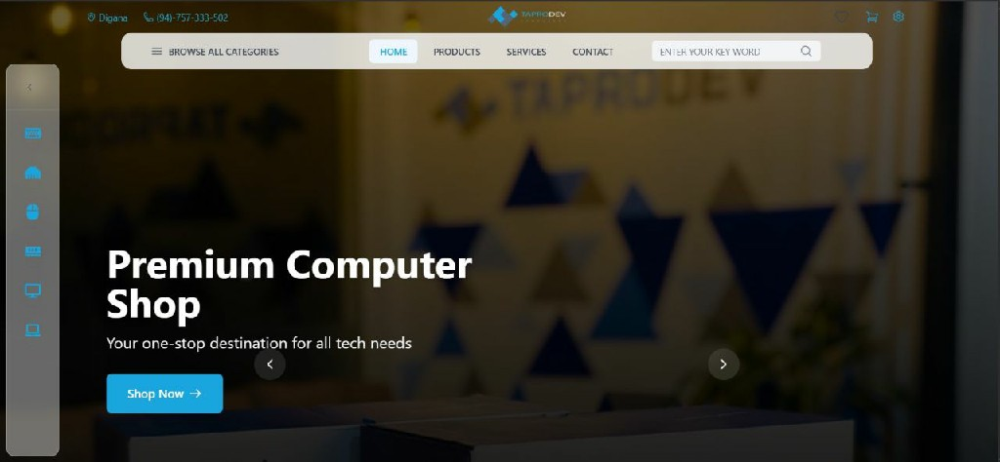
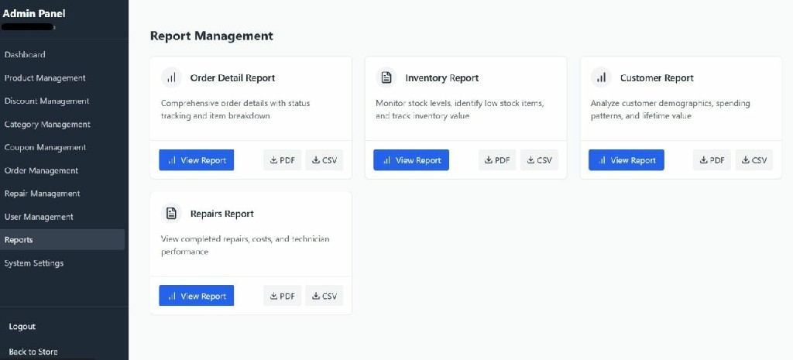
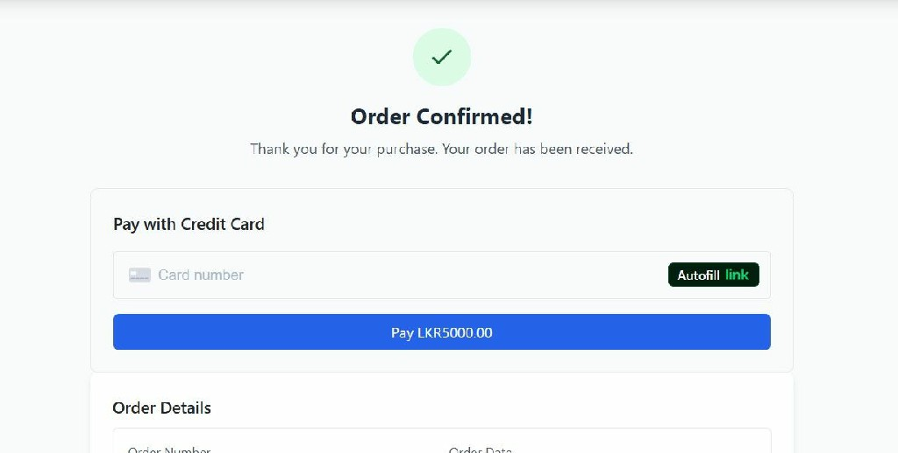
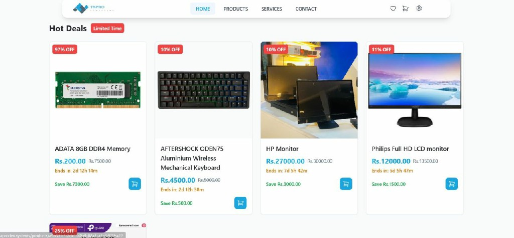

# ZeroX — Computer Shop Management System

<div align="center">



**A full-stack e-commerce and shop management platform for computer hardware retail**

[](https://react.dev/)
[](https://spring.io/projects/spring-boot)
[](https://www.mysql.com/)
[](https://docs.docker.com/compose/)
[](https://vitejs.dev/)
[](https://tailwindcss.com/)
[](https://stripe.com/)

</div>

---

## 📋 Table of Contents

- [Overview](#overview)
- [Screenshots](#screenshots)
- [Features](#features)
- [Tech Stack](#tech-stack)
- [Architecture](#architecture)
- [Project Structure](#project-structure)
- [Database Schema](#database-schema)
- [API Reference](#api-reference)
- [Getting Started](#getting-started)
  - [Prerequisites](#prerequisites)
  - [Docker (Recommended)](#docker-recommended)
  - [Manual Setup](#manual-setup)
- [Environment Variables](#environment-variables)
- [User Roles](#user-roles)
- [Key Modules](#key-modules)
- [Contributing](#contributing)

---

## Overview

**ZeroX** is a production-ready, full-stack computer shop management and e-commerce platform. It combines a React + Vite single-page application frontend with a Spring Boot REST API backend, backed by a MySQL 8 database. The entire stack is containerized with Docker Compose for one-command deployment.

The system covers the complete retail lifecycle — from customer browsing and Stripe-powered checkout, through inventory and order management, all the way to repair job tracking, analytics dashboards, and loyalty rewards — all accessible through role-based interfaces for customers, administrators, and technicians.

---

## Screenshots

### 🖥️ Admin Dashboard & Analytics



*Real-time sales metrics, order status charts, and inventory alerts.*

---

### 🛒 Customer Storefront


*Product browsing with category navigation, search, and featured listings.*

---

### 💳 Payments & Checkout



*Stripe-integrated checkout with coupon support and address management.*

---

### 📦 Product Catalog Management



*Admin product management with barcode scanning, image upload, and inventory tracking.*

---

## Features

### 🛍️ Online Storefront
- Responsive product catalog with category filtering and full-text search
- Product detail pages with image gallery, specs, and customer reviews
- Shopping cart with persistent state and real-time stock checks
- Wishlist management
- PC Building Guides content pages
- Store locator page

### 💳 Payments & Checkout
- **Stripe** payment integration with secure card processing
- Coupon and discount code redemption at checkout
- Multi-address management (save & select delivery addresses)
- Order confirmation emails via **SendGrid**

### 📊 Admin Dashboard
- Key metrics: revenue, orders, users, and inventory at a glance
- Interactive **Chart.js** order-status breakdown charts
- Low-stock alerts and stock-level monitoring

### 📦 Product & Inventory Management
- CRUD product management with image upload (`/uploads` served by backend)
- **Barcode scanning** via `@zxing/browser` for fast stock updates
- Category management with hierarchical parent/child structure
- Icon picker for category customization
- Inventory log history (RESTOCK / SALE / ADJUSTMENT events)
- Automatic low-stock alerts via MySQL trigger

### 🛠️ Repair & Service Tracking
- Customer-facing repair request submission (Desktop / Laptop / Other)
- Status tracking: `PENDING → IN_PROGRESS → COMPLETED / CANCELLED`
- Technician notes, estimated cost, and service fee recording
- Dedicated **Technician Dashboard** with role-protected routes
- Full repair history for customers and admins

### 📑 Order Management
- Full order lifecycle: `PENDING → PROCESSING → SHIPPED → DELIVERED / CANCELLED`
- Shipping tracking with carrier and estimated delivery date
- Return & refund workflow: `REQUESTED → APPROVED → REFUNDED`
- Order history for customers and admin order detail views

### 👥 User & CRM Management
- Role-based user management (CUSTOMER / ADMIN / TECHNICIAN)
- Customer profile editing, phone, and full-name updates
- **Loyalty / Rewards** system with points accumulation and tier levels

### 🎟️ Discounts & Coupons
- Percentage and fixed-amount discount types
- Coupon validity windows and maximum-use limits
- Coupon usage tracking per user

### 📈 Reports & Analytics
- Sales performance by period (daily / weekly / monthly)
- Inventory movement trend analysis
- Customer purchase behavior insights
- **PDF export** via `jsPDF` + `jsPDF-AutoTable`

### 🌙 UX & Accessibility
- Dark / Light theme toggle (ThemeContext)
- Multi-currency display (CurrencyContext)
- React lazy loading + Suspense for fast initial paint
- Framer Motion animations
- Toast notifications (react-toastify)
- Error boundaries for graceful failure handling

---

## Tech Stack

### Frontend

| Technology | Version | Purpose |
|---|---|---|
| React | 18.3 | UI framework |
| Vite | 6.2 | Build tool & dev server |
| React Router DOM | 6.22 | Client-side routing |
| TailwindCSS | 3.4 | Utility-first styling |
| Material UI (MUI) | 7.2 | Component library |
| Framer Motion | 12 | Animations |
| Chart.js | 4.4 | Data visualisations |
| Axios | 1.6 | HTTP client |
| React Hook Form + Zod | 7.54 / 4 | Form handling & validation |
| Stripe React/JS | 3.7 / 7.4 | Payment UI |
| @zxing/browser | 0.1.5 | Barcode scanning |
| jsPDF + AutoTable | 3 / 5 | PDF report export |
| JSBarcode | 3.11 | Barcode generation |
| jwt-decode | 4 | JWT token parsing |
| react-toastify | 11 | Toast notifications |
| Lucide React + React Icons | latest | Icon sets |

### Backend

| Technology | Version | Purpose |
|---|---|---|
| Spring Boot | 3.4.2 | Application framework |
| Spring Security | (boot managed) | Authentication & authorisation |
| Spring Data JPA | (boot managed) | ORM / data access |
| MySQL Connector/J | (boot managed) | Database driver |
| jjwt | 0.11.5 | JWT token generation & validation |
| Stripe Java SDK | 20.103.0 | Payment processing |
| SendGrid Java | 4.9.3 | Transactional email |
| Lombok | 1.18.32 | Boilerplate reduction |
| MapStruct | 1.5.5 | DTO ↔ entity mapping |
| SpringDoc OpenAPI | 2.5.0 | Swagger UI (`/swagger-ui.html`) |
| Flyway | 9.22.3 | Database migrations |
| Hibernate Types | 2.21.1 | JSON column support |
| dotenv-java | 3.0.0 | `.env` file support |
| Java | 19 | Runtime |

### Infrastructure

| Technology | Purpose |
|---|---|
| Docker & Docker Compose | Container orchestration |
| MySQL 8.0 | Relational database |
| Nginx | Serve React SPA + reverse proxy to backend API |
| Maven 3.9 | Backend build tool |

---

## Architecture

```
┌─────────────────────────────────────────────────────────┐
│                      Browser / Client                    │
└────────────────────────┬────────────────────────────────┘
                         │ HTTP :3000
┌────────────────────────▼────────────────────────────────┐
│              Nginx (Docker container)                    │
│   • Serves React SPA (dist/)                            │
│   • /api/* → proxy → backend:8080                       │
│   • /uploads/* → proxy → backend:8080                   │
│   • Gzip compression + security headers                 │
└────────────────────────┬────────────────────────────────┘
                         │ HTTP :8080
┌────────────────────────▼────────────────────────────────┐
│           Spring Boot API (Docker container)             │
│   • REST controllers  (/api/**)                         │
│   • Spring Security + JWT filter chain                  │
│   • Service layer (business logic)                      │
│   • JPA repositories → MySQL                            │
│   • /uploads/** static file serving                     │
└────────────────────────┬────────────────────────────────┘
                         │ TCP :3306
┌────────────────────────▼────────────────────────────────┐
│              MySQL 8 (Docker container)                  │
│   • Database: computer_shop                             │
│   • Persistent volume: mysql_data                       │
└─────────────────────────────────────────────────────────┘
```

All three containers communicate on the shared **`app-network`** Docker bridge network. The backend waits for a healthy MySQL `healthcheck` before starting. The frontend waits for the backend container to start.

---

## Project Structure

```
ZeroX/
├── docker-compose.yml          # Orchestrates all 3 services
├── Dockerfile.backend          # Multi-stage Maven → JRE image
├── Dockerfile.frontend         # Vite build → Nginx image
├── .env                        # Runtime environment variables
├── .env.docker.example         # Template for environment variables
├── databsev1.sql               # Seed / schema SQL
├── images/                     # Screenshots used in this README
│   ├── admin-dashboard.jpg
│   ├── dashboard.jpg
│   ├── payments.jpg
│   └── product-catelog.jpg
├── docs/                       # Project documentation
│   ├── ER Diagram.png
│   ├── UML Diagram.png
│   ├── High Level Diagram.png
│   ├── DatabaseV1.txt
│   ├── api-specifications.md
│   └── File Structure Backend.md
│
├── frontend/Computer_Shop/     # React + Vite SPA
│   ├── index.html
│   ├── vite.config.js
│   ├── tailwind.config.js
│   ├── nginx.conf              # Nginx config baked into frontend image
│   └── src/
│       ├── App.jsx             # Root component with context providers
│       ├── main.jsx
│       ├── routes/
│       │   └── AppRoutes.jsx   # All route definitions
│       ├── pages/              # 39 page-level components
│       │   ├── Home.jsx
│       │   ├── ProductsListing.jsx
│       │   ├── ProductDetails.jsx
│       │   ├── Cart.jsx
│       │   ├── Checkout.jsx
│       │   ├── OrderConfirmation.jsx
│       │   ├── OrderHistory.jsx
│       │   ├── OrderDetails.jsx
│       │   ├── Profile.jsx
│       │   ├── SavedAddresses.jsx
│       │   ├── WishlistPage.jsx
│       │   ├── Rewards.jsx
│       │   ├── Repair.jsx
│       │   ├── RepairHistory.jsx
│       │   ├── RepairDetail.jsx
│       │   ├── PCBuildingGuides.jsx
│       │   ├── ContactPage.jsx
│       │   ├── Stores.jsx
│       │   ├── AdminDashboard.jsx
│       │   ├── ProductManagement.jsx
│       │   ├── CategoryManagement.jsx
│       │   ├── OrderManagement.jsx
│       │   ├── AdminOrderDetails.jsx
│       │   ├── UserManagement.jsx
│       │   ├── DiscountManagement.jsx
│       │   ├── CouponManagement.jsx
│       │   ├── RepairManagement.jsx
│       │   ├── ReportManagement.jsx
│       │   ├── Settings.jsx
│       │   ├── TechnicianDashboard.jsx
│       │   ├── Login.jsx
│       │   ├── Register.jsx
│       │   └── ...
│       ├── components/
│       │   ├── admin/          # Admin-specific components
│       │   │   ├── BarcodeInput.jsx
│       │   │   ├── ProductModal.jsx
│       │   │   ├── CategoryModal.jsx
│       │   │   ├── DiscountModal.jsx
│       │   │   ├── DashboardStats.jsx
│       │   │   ├── OrderStatusChart.jsx
│       │   │   ├── IconPickerModal.jsx
│       │   │   └── ConfirmModal.jsx
│       │   ├── product/
│       │   │   └── ProductCard.jsx
│       │   ├── payment/
│       │   ├── discount/
│       │   ├── reports/
│       │   ├── home/
│       │   ├── auth/
│       │   ├── layouts/
│       │   │   ├── MainLayout.jsx
│       │   │   ├── AdminLayout.jsx
│       │   │   ├── TechnicianLayout.jsx
│       │   │   └── AuthLayout.jsx
│       │   └── common/
│       │       ├── ErrorBoundary.jsx
│       │       └── LoadingOverlay.jsx
│       ├── context/
│       │   ├── AuthContext.jsx
│       │   ├── CartContext.jsx
│       │   ├── WishlistContext.jsx
│       │   ├── ThemeContext.jsx
│       │   ├── CurrencyContext.jsx
│       │   ├── CategoriesContext.jsx
│       │   └── ToastContext.jsx
│       ├── services/           # Axios API service modules
│       │   ├── api.js          # Axios instance + JWT interceptor
│       │   ├── authService.js
│       │   ├── productService.js
│       │   ├── orderService.js
│       │   ├── cartService.js
│       │   ├── paymentService.js
│       │   ├── couponService.js
│       │   ├── discountService.js
│       │   ├── repairService.js
│       │   ├── reportService.js
│       │   ├── rewardService.js
│       │   ├── categoryService.js
│       │   ├── userService.js
│       │   ├── wishlistService.js
│       │   ├── addressService.js
│       │   └── settingsService.js
│       ├── hooks/
│       │   └── useApiHealthCheck.js
│       ├── config/
│       └── utils/
│           └── iconRegistry.jsx
│
└── backend/csm/                # Spring Boot application
    ├── pom.xml
    └── src/main/java/com/zerox/csm/
        ├── CsmApplication.java
        ├── config/
        │   ├── SecurityConfig.java     # Spring Security + JWT filter
        │   └── WebConfig.java          # CORS + static resource mapping
        ├── controllers/               # 27 REST controllers
        │   ├── AuthController.java
        │   ├── ProductController.java
        │   ├── CategoryController.java
        │   ├── OrderController.java
        │   ├── PaymentController.java
        │   ├── CartController.java
        │   ├── WishlistController.java
        │   ├── RepairController.java
        │   ├── ReviewController.java
        │   ├── CouponController.java
        │   ├── ProductDiscountController.java
        │   ├── RewardPointsController.java
        │   ├── ReportController.java
        │   ├── UserManagementController.java
        │   ├── CustomerAddressController.java
        │   ├── ShippingController.java
        │   ├── ReturnController.java
        │   ├── ImageController.java
        │   ├── SearchController.java
        │   ├── SettingsController.java
        │   └── ...
        ├── service/                   # 23 business-logic services
        ├── repository/                # Spring Data JPA repositories
        ├── model/                     # 25 JPA entity classes
        │   ├── User.java
        │   ├── Product.java
        │   ├── Category.java
        │   ├── Order.java / OrderItem.java
        │   ├── Cart.java / CartItem.java
        │   ├── WishlistItem.java
        │   ├── Repair.java
        │   ├── Review.java
        │   ├── Coupon.java / CouponUsage.java
        │   ├── ProductDiscount.java
        │   ├── RewardPoints.java
        │   ├── Shipping.java
        │   ├── Return.java
        │   ├── CustomerAddress.java
        │   ├── InventoryLog.java
        │   ├── StockAlert.java
        │   ├── Settings.java
        │   └── LoyaltyTier.java
        ├── dto/                       # Request / Response DTOs
        ├── security/                  # JWT utilities & filters
        └── exception/                 # Custom exception handlers
```

---

## Database Schema

The application uses **MySQL 8** with the following core tables:

| Table | Description |
|---|---|
| `users` | Customers, admins, and technicians with role enum |
| `categories` | Self-referencing hierarchical product categories |
| `products` | Products with SKU, barcode, stock, and warranty |
| `orders` | Customer orders with payment and status tracking |
| `order_items` | Line items for each order |
| `inventory_logs` | Full audit trail of stock changes |
| `customer_addresses` | Multiple saved addresses per user |
| `reviews` | Star ratings (1–5) and text reviews per product |
| `repair_requests` | Repair jobs with device info and technician notes |
| `shipping` | Carrier and tracking info per order |
| `returns` | Return/refund requests linked to orders |
| `discounts` | Percentage or fixed discount codes with validity |
| `stock_alerts` | Auto-generated by MySQL trigger on low stock |

> A MySQL **trigger** (`inventory_update_trigger`) automatically inserts a `stock_alerts` record whenever a product's `stock_quantity` drops below its `low_stock_threshold`.

See [`docs/DatabaseV1.txt`](docs/DatabaseV1.txt) for full DDL and [`docs/ER Diagram.png`](docs/ER%20Diagram.png) for the entity-relationship diagram.

---

## API Reference

The Spring Boot backend exposes a full REST API under `/api/**`. Interactive documentation is available at:

```
http://localhost:8080/swagger-ui.html
```

### Authentication

| Method | Endpoint | Auth | Description |
|---|---|---|---|
| `POST` | `/api/auth/register` | Public | Register a new user |
| `POST` | `/api/auth/login` | Public | Login and receive JWT |
| `POST` | `/api/auth/logout` | 🔒 User | Invalidate session |
| `GET` | `/api/auth/profile` | 🔒 User | Get current user profile |

### Products

| Method | Endpoint | Auth | Description |
|---|---|---|---|
| `GET` | `/api/products` | Public | List all products |
| `GET` | `/api/products/{id}` | Public | Get single product |
| `POST` | `/api/products` | 🔒 Admin | Create product |
| `PUT` | `/api/products/{id}` | 🔒 Admin | Update product |
| `DELETE` | `/api/products/{id}` | 🔒 Admin | Delete product |

### Orders & Payments

| Method | Endpoint | Auth | Description |
|---|---|---|---|
| `GET` | `/api/orders` | 🔒 Admin | List all orders |
| `GET` | `/api/orders/{id}` | 🔒 User/Admin | Get order details |
| `POST` | `/api/orders` | 🔒 User | Create order |
| `PUT` | `/api/orders/{id}` | 🔒 Admin | Update order status |
| `POST` | `/api/payments` | 🔒 User | Process Stripe payment |

### Repairs

| Method | Endpoint | Auth | Description |
|---|---|---|---|
| `GET` | `/api/repairs` | 🔒 Admin | List all repair requests |
| `POST` | `/api/repairs` | 🔒 User | Submit repair request |
| `PUT` | `/api/repairs/{id}` | 🔒 Admin | Update repair status |

### Other Endpoints

`/api/categories` · `/api/cart` · `/api/wishlist` · `/api/reviews` · `/api/coupons` · `/api/discounts` · `/api/rewards` · `/api/reports` · `/api/users` · `/api/addresses` · `/api/shipping` · `/api/returns` · `/api/settings` · `/api/search` · `/api/images`

See [`docs/api-specifications.md`](docs/api-specifications.md) and [`docs/APIs/`](docs/APIs/) for full endpoint documentation.

---

## Getting Started

### Prerequisites

- [Docker Desktop](https://www.docker.com/products/docker-desktop/) (v24+) — recommended path
- **— OR —** for manual setup:
  - Java 19+, Maven 3.9+
  - Node.js 18+, npm 9+
  - MySQL 8.0

### Docker (Recommended)

> One-command startup. No local Java or Node.js required.

**1. Clone the repository**
```bash
git clone https://github.com/AnjanaKvd/ZeroX.git
cd ZeroX
```

**2. Configure environment variables**
```bash
cp .env.docker.example .env
```
Edit `.env` and fill in your values (see [Environment Variables](#environment-variables)).

**3. Start all services**
```bash
docker compose up -d --build
```

**4. Open the application**

| Service | URL |
|---|---|
| Frontend (React) | http://localhost:3000 |
| Backend API | http://localhost:8080 |
| Swagger UI | http://localhost:8080/swagger-ui.html |
| MySQL | `localhost:3307` (host-mapped port) |

**5. Stop services**
```bash
docker compose down
```

> **Note:** MySQL data is persisted in the `mysql_data` Docker volume and uploaded files in `backend_uploads`. To wipe all data: `docker compose down -v`.

---

### Manual Setup

#### Backend (Spring Boot)

```bash
cd backend/csm

# Copy and configure environment
cp .env.example .env
# Edit .env with your MySQL and JWT settings

# Run the application
./mvnw spring-boot:run
```

The API will start on `http://localhost:8080`.

#### Frontend (React + Vite)

```bash
cd frontend/Computer_Shop

# Copy environment config
cp .env.example .env
# Set VITE_API_URL=http://localhost:8080

# Install dependencies
npm install

# Start development server
npm run dev
```

The app will start on `http://localhost:5173`.

#### Database

1. Create a MySQL 8 database: `CREATE DATABASE computer_shop;`
2. Create a user and grant privileges (or use root for development)
3. The application will auto-create tables via Spring Data JPA (`spring.jpa.hibernate.ddl-auto`)

---

## Environment Variables

Copy `.env.docker.example` → `.env`

---

## User Roles

| Role | Access |
|---|---|
| `CUSTOMER` | Storefront, cart, checkout, orders, repairs, reviews, rewards, profile |
| `ADMIN` | All customer routes + full admin dashboard (products, orders, users, discounts, coupons, reports, settings, repair management) |
| `TECHNICIAN` | Technician dashboard, repair management, orders, reports |

Routes are protected by the `ProtectedRoute` component on the frontend and Spring Security method-level security on the backend.

---

## Key Modules

### 🛍️ Online Storefront
Full e-commerce experience — product catalog, filtering, search, cart, and Stripe checkout with coupon support and email confirmation.

### 📦 Inventory Management
Real-time stock tracking with barcode/QR scanning (`@zxing`), automatic low-stock alerts via MySQL trigger, inventory change audit logs, and category management.

### 👥 Customer Relationship Management
Customer profiles with purchase history, a points-based loyalty and rewards system, and automated email notifications via SendGrid.

### 🔧 Repair & Service Tracking
Online repair submission, status tracking (`PENDING → IN_PROGRESS → COMPLETED`), technician notes/cost estimation, and customer repair history.

### 🚚 Order & Delivery Management
Full order lifecycle management, shipping carrier tracking, and return/refund workflow.

### 📊 Analytics & Reporting
Sales dashboards with Chart.js visualisations, inventory and customer behaviour reports, and PDF export powered by jsPDF.

### 🔐 Security
JWT-based stateless authentication, role-based route guarding on both frontend and backend, CORS configured per environment, and security HTTP headers enforced by Nginx.

---

## Contributing

1. Fork the repository
2. Create a feature branch: `git checkout -b feature/your-feature`
3. Commit your changes: `git commit -m 'feat: add your feature'`
4. Push to the branch: `git push origin feature/your-feature`
5. Open a Pull Request

---

<div align="center">

**ZeroX** — Built with ❤️ using React, Spring Boot & MySQL

</div>
